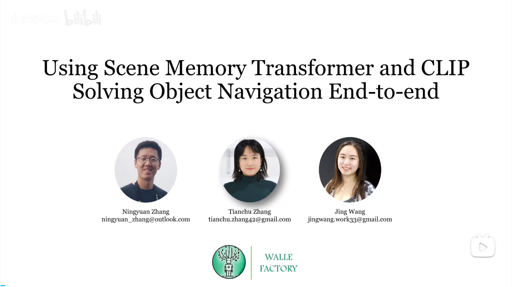

# Using Scene Memory Transformer and CLIP to Solve Object Navigation End-to-end
Jing Wang*, Tianchu Zhang*, Ningyuan Zhang

## 介绍
在Meta 2022年举办的Habitat物体导航（Object Navigation）中获得第三名，成功率61%。
任务：在物体导航中，代理被随机初始化在一个位置环境中的随机位置和朝向，它需要导航去找到任意一个对应某类别的物体，给他提供的指令例如：“找到一把椅子”。agent不知道环境的地图，只有自身的一些传感器信息。
agent配备了一个RGB-D摄像头和一个精确的位置传感器。位置传感器提供agent相对于初始位置时的平面位置和朝向。agent的动作

数据集和仿真：

[//]: # ([![Image text]&#40;https://github.com/Chortine/Habitat-Object-Navigation/blob/main/resource/img_bilibili.png&#41;]&#40;https://www.bilibili.com/video/BV1Eh4y1475R/?spm_id_from=333.999.0.0&#41;)

[comment]: <> ([]&#40;https://www.bilibili.com/video/BV1Eh4y1475R/?spm_id_from=333.999.0.0&#41;)

## 比赛结果
<!--  -->

Habitat官网截图

<!-- 

 -->

## 网络结构

<!--  -->

## Key designs that contribute to final results
1. 网络结构
比较了LSTM， GRU，和Transfomer对导航相关的记忆的处理能力，最后选择了transformer。在Transformer的使用上，我们参考了Kuan Fang[1]的一篇工作。
3. CLIP Encoder
比较了普通Resnet，R3M Encoder, 和 CLIP Encoder。最后使用了
5. 数据标注

## 开放讨论
1. 网络如何具备空间感知？ 在我们的测试中，发现agent会出现原地转圈等现象，调整奖励函数还是难以消除这个现象，我们认为，现在的网络结构设计不足以让agent形成稳定的空间表征。后续值得探索的话题有：怎么定义空间表征？怎么设计网络/训练方式，来给agent加入归纳偏置帮助它更好学习空间感知。空间表征包括对一个隐式地图的建立，维护，以及信息提取的过程。
3. 有一些可以参考的方法，比如说Nerf和OSRT这样具有三维旋转平移不变性的网络或许能成为很好的encoder。以及有的在训练中添加辅助任务，例如[2]，来帮助普通的CNN的视觉Encoder学到具有空间平移旋转不变性的图像特征。

## 参考文献
[1] [Kuan Fang](https://arxiv.org/abs/1903.03878)
[3] Dog
